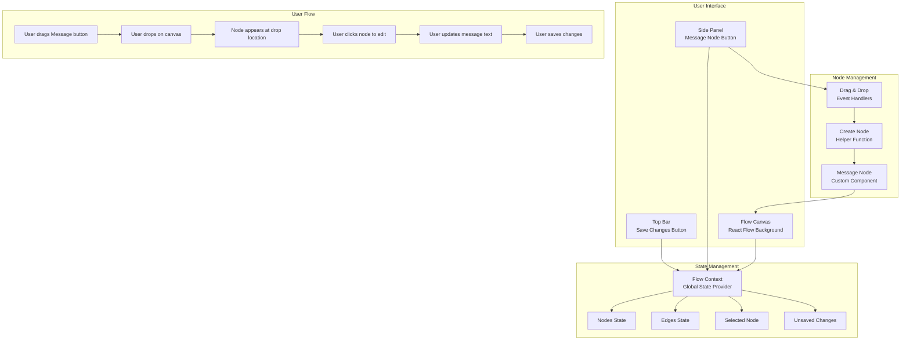

# Bitespeed Chatbot Flow Interface

A modern, interactive chatbot flow builder built with Next.js, React Flow, Shadcn/ui, and Tailwind CSS. This application allows users to visually design and manage chatbot conversation flows through an intuitive drag-and-drop interface.

## 🎯 What It Does

**Bitespeed Chatbot Flow Interface** is a visual flow builder that enables users to:
- **Drag and drop** message nodes onto a canvas to create conversation flows
- **Edit message content** by selecting nodes and updating text
- **Connect nodes** to build conversation logic and user journey paths
- **Save and manage** chatbot flow configurations
- **Visualize** the complete chatbot structure in an organized, scalable way

## 🏗️ Application Architecture



## ✨ Key Features

### 🎨 **Visual Flow Builder**
- **React Flow Canvas**: Interactive, scalable canvas with dotted background
- **Drag & Drop**: Intuitive node creation by dragging from side panel
- **Node Management**: Create, edit, and organize message nodes
- **Flow Visualization**: See your entire chatbot conversation structure

### 🎛️ **User Interface**
- **Top Bar**: Clean header with "Save Changes" button that activates when modifications are made
- **Side Panel**: Right-side panel with draggable "Message" button for adding new nodes
- **Dual-Screen Panel**: 
  - **Nodes Screen**: Add new message nodes
  - **Edit Screen**: Modify selected node content via input field

### 🔧 **Technical Features**
- **TypeScript**: Full type safety for all components and state
- **React Context**: Centralized state management for nodes, edges, and UI state
- **Performance Optimized**: Uses `useMemo` and `useCallback` for efficient rendering
- **Responsive Design**: Clean white and light green theme with Tailwind CSS

## 🚀 Getting Started

1. **Install dependencies:**
   ```bash
   npm install
   ```

2. **Start the development server:**
   ```bash
   npm run dev
   ```

3. **Open your browser** and navigate to [http://localhost:3000](http://localhost:3000)

## 🎮 How to Use

### **Adding Message Nodes**
1. **Drag** the "Message" button from the right side panel
2. **Drop** it anywhere on the canvas
3. **Click** the newly created node to edit its content

### **Editing Node Content**
1. **Click** on any message node to select it
2. **Edit** the message text in the input field
3. **Save** your changes or cancel to revert

### **Managing Your Flow**
- **Drag nodes** around the canvas to reposition them
- **Connect nodes** by dragging from source to target handles
- **Save changes** using the top bar button when you have unsaved modifications

## 🛠️ Technologies Used

- **Next.js 15**: Modern React framework with App Router
- **TypeScript**: Type safety and enhanced developer experience
- **Tailwind CSS**: Utility-first CSS framework for rapid styling
- **Shadcn/ui**: High-quality, accessible UI component library
- **React Flow**: Powerful library for building node-based interfaces
- **Lucide React**: Beautiful, customizable icon library

## 📁 Project Structure

```
src/
├── app/                 # Next.js app directory
├── components/          # Reusable UI components
│   ├── canvas/         # Flow canvas and related components
│   ├── layout/         # Layout components (TopBar, etc.)
│   ├── nodes/          # Custom node components
│   ├── panels/         # Side panel components
│   └── ui/             # Shadcn/ui components
├── contexts/            # React Context providers
├── helpers/             # Utility functions
├── types/               # TypeScript type definitions
└── lib/                 # Utility libraries
```

## 🔄 State Management

The application uses React Context (`FlowContext`) to manage:
- **Nodes**: All message nodes on the canvas
- **Edges**: Connections between nodes
- **Selected Node**: Currently selected node for editing
- **Unsaved Changes**: Track modifications for save button state
- **Loading States**: UI feedback during operations

## 🎯 Use Cases

- **Customer Support Bots**: Design automated response flows
- **Lead Generation**: Create interactive qualification sequences
- **FAQ Systems**: Build intelligent question-answer flows
- **Onboarding**: Design user onboarding experiences
- **E-commerce**: Create shopping assistant flows

## 🚧 Future Enhancements

- **Multiple Node Types**: Support for different conversation elements
- **Conditional Logic**: Add decision nodes and branching
- **Integration APIs**: Connect to external chatbot platforms
- **Flow Templates**: Pre-built conversation templates
- **Export/Import**: Save and share flow configurations
- **Analytics**: Track flow performance and user interactions

## 🤝 Contributing

This project follows industry best practices for code organization and architecture. Contributions are welcome!

## 📄 License

This project is part of the Bitespeed ecosystem for building intelligent chatbot solutions.
